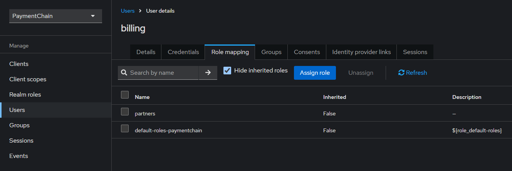

# Maven mono repository to bank startup

## Diagrama de Arquitectura

## Flujo de autenticación - Keycloak


### 1. Compilar todos los microservicios y generar imágenes de docker
Se puede entrar a cada proyecto y correr ```mvn package``` para vs code está el archivo ```tasks.json``` y con el comando ```ctrl + shift + p``` -> buscar la opción ```Run Task``` y correr las tareas en el siguien orden

- *Microservices - Build All* (Entra a cada folder y compila los proyectos para generar el .jar)
- *Docker Build All* (Entra a cada folder y genera la imagen de docker)

### 2. Generar el contenedor de docker con todos los servicios
En el folder principal está el archivo ```docker-compose.yml``` que se encarga de orquestar los siguientes servicios

- App de ```customers```
- App de ```productos```
- App de ```transactions```
- App de ```registry-discovery``` eureka para comunicar los microservicios
- App de ```spring-admin``` para administar las aplicaciones
- Base de datos ```postgres```
- Administrator de base de datos ```pgadmin```
- App de autenticación ```Keycloack```

### 3. Configuración del Keycloack
1. Crear un Realm - Hace referencia a una organización para manejar permisos y roles, no es correcto usar el Realm master que viene por defecto


2. Crear un rol llamdo partners


3. Crear un usario llamado billing
- Indicar Email, First Namey Last Name
- En el apartado de Credentials crear una contraseña ```1234```

- En los roles asociar el rol previamente creado


4. En clientes crear uno nuevo con el nombre ``front-angular-billing-app`` va a ser el cliente que querrá hacer uso de nuestros microservicios


5. Ya con eso puede generar el Access Token el cliente


### 3. Endpoints generados // TODO
2. [Swagger Interface](http://localhost:8081/swagger-ui)
2. [Access to h2 database](http://localhost:8081/h2-console/)
2. [Access to pg admin](http://localhost:80)

## Pruebas

### Creación de productos ```POST /products```

#### Cuenta horros
 ```json
 {
    "id": 1,
    "code": "01",
    "name": "Cuenta horros"
  }
```
#### Tarjeta credito
 ```json
  {
    "id": 2,
    "code": "005",
    "name": "tarjeta credito"
  }
```
#### Puntos banco
 ```json
  {
    "id": 3,
    "code": "00687l",
    "name": "Puntos banco"
  }
```

### Creación de transacciones ```POST /transactions```

##### Transacción 1
```json
{
  "id": 0,
  "reference": "6524ld",
  "accountIban": "000251487",
  "date": "2022-08-15T11:36:07.683Z",
  "amount": 450,
  "fee": 2,
  "description": "Consignación",
  "status": "LIQUIDADA",
  "channel": "OFICINA"
}
```
#### Transacción 2
```json
{
  "id": 0,
  "reference": "hg52487",
  "accountIban": "000251487",
  "date": "2022-11-10T15:20:00.437Z",
  "amount": 100,
  "fee": 3,
  "description": "Retiro",
  "status": "RECHAZADA",
  "channel": "WEB"
}
```
#### Transacción 3
```json
{
  "id": 0,
  "reference": "53254jks",
  "accountIban": "000257849",
  "date": "2022-11-10T15:20:00.437Z",
  "amount": 100,
  "fee": 3,
  "description": "Retiro",
  "status": "LIQUIDADA",
  "channel": "WEB"
}
```

## Creación de clientes  ```POST /customer/V1```
#### Cliente 1
```json
{
  "id": 0,
  "code": "01",
  "name": "Carlos",
  "phone": "string",
  "iban": "000251487",
  "surname": "string",
  "address": "string",
  "products": [
    {
      "id": 0,
      "productId": 1,
      "productName": "string"
    },
 {
      "id": 0,
      "productId": 2,
      "productName": "string"
    }
  ],
  "transactions": [
    {}
  ]
}
```

Si todo sale bien, al consultar el servicio ```GET customer/V1/full``` con el código de cliente 01, deberá traer toda la info de ```cliente + productos + transacciones```


